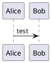

# jekyll-plantuml

Generate [PlantUML](https://plantuml.com) for your jekyll thingamajig.

This was inspired by [yjpark/jekyll-plantuml](https://github.com/yjpark/jekyll-plantuml) and [yegor256/jekyll-plantuml](https://github.com/yegor256/jekyll-plantuml), but I felt a full rewrite was in order as I wanted more options, like generating svg instead of png, and I wanted to generate uml from bigly files, not small inlined texts (although I might add the ability to inline at some point).

This plugin will generate PlantUML from files with all extensions that are supported by `vscode-plantuml`:
https://github.com/qjebbs/vscode-plantuml/issues/138

That is `*.wsd`, `*.pu`, `*.puml`, `*.plantuml`, `*.iuml`.

## Installation

### 1. Get dis plugin


You can use git submodules to install this as a plugin.

From your jekyll folder:

```bash
mkdir _plugins # if need be
cd _plugins
git submodule add https://github.com/ValentineStone/jekyll-plantuml
```

### 2. Get PlantUML

Get yerself a `plantuml.jar` from https://plantuml.com/download

### 3. (Optional) Get Graphviz

You also might, or might not (more likely) need [GraphViz](https://en.wikipedia.org/wiki/Graphviz).  
Id recommend just trying to run without it, and in case it does not work check out https://plantuml.com/graphviz-dot for info on how to get dat GraphViz.

## Configuration
You can configure dis boi in `_config.yml` under `plantuml` key:

```yml
plantuml:
  plantuml_jar: c:/path/plantuml.jar # path to plantuml.jar
  type: utxt                         # type (passed as -t option, ex: -tutxt)
  extension: txt                     # output extension override
  plantuml_args: -nometadata         # extra args to be passed to plantuml
  java_args: -Xmx1G                  # extra args to be passed to java
```

- `plantuml_jar` is just `plantuml.jar` by default
- `type` is svg by default
- `extension` is deduced from `type` according to **"Types of Output File"** table over at [https://plantuml.com/command-line](https://plantuml.com/command-line#ezoic-pub-ad-placeholder-114) (ex: `type: braille` gives you `extension: png`), but can be specified to override it (like say generating a .txt file instead of .atxt or .utxt)
- `plantuml_args` are any of the arguments you can find on https://plantuml.com/command-line
- `java_args` are ye java arguments  
Both `_args` options are empty strings by default

## How work?

A [jekyll-optional-front-matter](https://github.com/benbalter/jekyll-optional-front-matter) inspired [`Jekyll::Generator`](https://jekyllrb.com/docs/plugins/generators/) is used to get all the PlantUML files with specified extensions and turn them into [Pages](https://jekyllrb.com/docs/pages/), to be then processed by a [`Jekyll::Converter`](https://jekyllrb.com/docs/plugins/converters/).

This `Jekyll::Converter` expands the config into
```ruby
"java -Djava.awt.headless=true #{java_args} -jar #{plantuml_jar} -t#{type} #{plantuml_args} -pipe"
```
and pipes the output from that into the newly generated page, which is then saved with the same file path and name, but under new `extension`.

## Usage

#### graph.plantuml


#### graph<span>.</span>md
```md

```

#### _config.yml
```yml
plantuml:
  plantuml_jar: c:/path/plantuml.jar
```
***This will get you generating svg files from plantuml in no time ;)***
