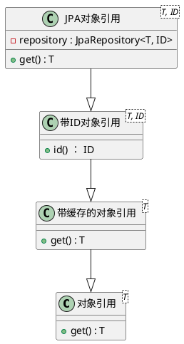

## 前言

在DDD的实践中，聚合是第一个要面对的概念。通俗点的概念讲，聚合就是类似主从表结构，我们把主表称为“聚合根”。DDD建议我们在聚合内部实体之间的引用直接使用关联，聚合之间的相互引用就要通过“对象引用”进行。

我们通常的应用都会用到数据库，按照DDD的要求，那就是直接用ID进行引用。类似如下，对“学校”实体的引用变成了 `Long schoolId`。如果是在面向对象的结构中，正确的引用方式应该是 `School school`。

```java
@Data
class PersonDDD {
    Long id;
    String name;
    Long schoolId;
}

@Data
class PersonOO {
    Long id;
    String name;
    School school;
}

```
一个复杂的系统中，可以存在大量的聚合，每个聚合之间存在复杂的关联关系，如果直接使用ID来查询，会导致每次要使用对象前都要根据ID来一次查询，势必引起业务的复杂化，把已经本来就很复杂的代码结构更加复杂化。

Spring Data中提供了诸如 Aggregate Roots 和相关 Domain Events 事件机制。但是并没有给出一个好的解决聚合引用的方案。


## 方案

本文实现方案是仿照C语言的指针概念，实现了完全面向对象化的聚合对象引用。总体架构图如下：




其中，对象引用是基础接口，所有需要用到对象的时候，就调用 `.get()` 接口获取。最终在数据层实现自带jpa存取接口，通过id查询获得对象。

## 使用

将开始的案例修改一下：

```java

interface Refer<T> {
    T get();
}

@Value
public class JpaRefer<T, ID> implements Refer<T> {
    private ID id;
    private JpaRepository<T, ID> repository;

    public T get() {
        return repository.findById(id);
    }
}

@Data
class PersonOO {
    Long id;
    String name;
    JpaRefer<School> school;
}

```
在实际使用的时候，除了要多调用一次 `get` 之外，从使用体验角度来说，没有太多的改变。但是实现了聚合间对象引用的解耦。


