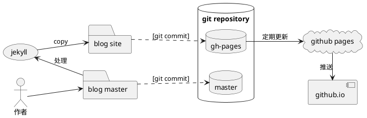

## 前言

突然想起来要好好整理一下自己的博客空间，已经荒废很多年，如果再不捡起来，等到自己知识老化的时候再去写东西就没人看了。

使用Github Pages + Jekyll把博客发布为静态网站，给人感觉比较私密，似乎所有的控制权都抓在自己手里的样子。
但是作为一个技术博客，如果写东西没有[PlantUML](http://plantuml.com)的加持，当然效率就会差很多。

本文内容记录了断断续续将近一周的折腾。

## `PlantUML` 插件

目前支持 `PlantUML` 的插件我找到了好几个，但是最终使用的是 `kramdown-plantuml`，另外一个 `jekyll-spaceship` 插件支持更多的功能，
如果需要安装的话，只需要装任意一个就可以支持 `PlantUML` 了，不需要两个都装。
但是从我的实践来看，`jekyll-spaceship` 插件生成 `PlantUML` 图形会直接生成引用 plantuml.com 的生成功能，我觉得还是不可接受的。
人家是免费提供给你使用，作为一个静态网站，你一遍遍让人家帮你生成图形干嘛？不地道！所以我推荐 `kramdown-plantuml`，没那么多功能，但是规矩。

### 安装

安装两个插件的功能的方法如下，各位看官可以择一个安装：

1. 修改根目录下的 `Gemfile`，找到`group :jekyll_plugins do`位置，在其中加入所需的两个插件：

```ruby
gem 'kramdown-plantuml'

group :jekyll_plugins do
  gem "jekyll-feed", "~> 0.12"
  gem 'jekyll-spaceship'
end
```
2. 在 `_config.yml` 中找到 `plugins:` 位置，并加入两个插件

```yml
plugins:
  - "jekyll-paginate"
  - "kramdown-plantuml"
  - "jekyll-spaceship"
```
3. 继续在 `_config.yml` 中加入两个插件的配置项
<pre>
jekyll-spaceship:
  # default enabled processors
  processors:
    - table-processor
    - mathjax-processor
    - plantuml-processor
    - mermaid-processor
    - polyfill-processor
    - media-processor
    - emoji-processor
    - element-processor
  mathjax-processor:
    src:
      - https://polyfill.io/v3/polyfill.min.js?features=es6
      - https://cdn.jsdelivr.net/npm/mathjax@3/es5/tex-mml-chtml.js
    config:
      tex:
        inlineMath:
          - ['$','$']
          - ['\(','\)']
        displayMath:
          - ['$$','$$']
          - ['\[','\]']
      svg:
        fontCache: 'global'
    optimize: # optimization on building stage to check and add mathjax scripts
      enabled: true # value `false` for adding to all pages
      include: []   # include patterns for math expressions checking (regexp)
      exclude: []   # exclude patterns for math expressions checking (regexp)
  plantuml-processor:
    mode: default  # mode value 'pre-fetch' for fetching image at building stage
    css:
      class: plantuml
    syntax:
      code: 'plantuml!'
      custom: ['@startuml', '@enduml']
    src: http://www.plantuml.com/plantuml/svg/
  mermaid-processor:
    mode: default  # mode value 'pre-fetch' for fetching image at building stage
    css:
      class: mermaid
    syntax:
      code: 'mermaid!'
      custom: ['@startmermaid', '@endmermaid']
    config:
      theme: default
    src: https://mermaid.ink/svg/
  media-processor:
    default:
      id: 'media-{id}'
      class: 'media'
      width: '100%'
      height: 350
      frameborder: 0
      style: 'max-width: 600px; outline: none;'
      allow: 'encrypted-media; picture-in-picture'
  emoji-processor:
    css:
      class: emoji
    src: https://github.githubassets.com/images/icons/emoji/
</pre>

这里也要吐槽 `jekyll-spaceship`，上面这段原文里的 `@startuml` 这种标注直接给我解析成了它要识别的指令，加任何折衷都不行。
这也是最终被我抛弃的原因之一。

4. 启动命令行，在git工程目录运行命令 `bundle install` 下载并安装插件。

如果运行的时候出现类似错误 `Warning: the fonts "Times" and "Times" are not available for the Java logical font`，表示电脑中缺少字体。
尤其是Mac电脑，请到 [https://www.freebestfonts.com/timr45w-font] 下载并安装字体。

### 使用插件

在 markdown 中使用 `PlantUML` 插件的方法也很简单，使用如下源代码形式即可：

````markdown
```plantuml
a --> b
```
````

要注意，使用 `jekyll-spaceship` 插件的时候，默认的代码块名称加了一个`!` ，需要手工把上面配置项 `code: 'plantuml!'` 去掉感叹号。

## 静态网站生成

### 静态网站方案

静态网站的最终方案是使用分支进行区分，`master` 分支存放博客的源代码， `gh-pages` 分支存放生成的 `_site` 目录中的内容。
如果尚未创建 `gh-pages` 分支，可以用如下的方法创建：

```bash
git checkout --orphan gh-pages
git rm -rf .
git commit --allow-empty -m "initial commit"
git push origin gh-pages
```

Github Pages默认假设 `gh-pages` 分支中存放的是 jekyll 格式的源码，会自动构建之。为了阻止自动构建，需要在 `gh-pages` 分支的根目录中
存放一个 `.nojekyll` 文件。

为了确保工作的自动化，我在磁盘上放置了两个文件夹，一个是 `blog-master` 存放源代码，并和 `master`分支关联，一个是 `blog-site` 用来存放输出的静态网页，
并和 `gh-pages` 分支关联。这样两个可以互不干扰。



### 自动复制

jekyll 使用指令 `bundle exec jekyll build` 或 `bundle exec jekyll serve` 处理页面代码之后的静态内容全部都放在 `_site` 目录下，需要手工复制到 `blog-site` 目录，所以我们需要自动化脚本来处理这些事情。

编辑根目录下的 `Rakefile` 在尾部增加：

```ruby
# copy from https://www.sitepoint.com/jekyll-plugins-github/
# 
GH_PAGES_DIR = "blog-site"

desc "Build Jekyll site and copy files"
task :build do
  system "jekyll build"
  system "rm -r ../#{GH_PAGES_DIR}/*" unless Dir['../#{GH_PAGES_DIR}/*'].empty?
  system "cp -r _site/* ../#{GH_PAGES_DIR}/"
  system "echo nojekyll > ../#{GH_PAGES_DIR}/.nojekyll"
end
```

然后检查 `_config.xml` 中的 `exclude` 项，把 `Rakefile` 加进去。我的该项配置内容如下，加了好多东西：

```yml
exclude:
  [
    "less",
    "node_modules",
    "Gruntfile.js",
    "package.json",
    "package-lock.json",
    "README.md",
    "README.zh.md",
    "Rakefile"
  ]
```

### 网站预览

静态内容在 `blog-site` 目录下，并没有任何支持浏览器访问浏览的功能。为了把这个目录中的内容可网络访问，可以在 `blog-site` 目录下启动命令行运行

```bash
python3 -m http.server
```

我的Mac电脑里有python环境，可以直接使用，如果各位看官运行命令的时候出现异常，请先检查python环境。

## 自动化辅助功能

rake post title="My first blog"

rake build

## 参考文献

1. [Github page搭建博客使用自定义插件的方法](https://www.bbsmax.com/A/A2dm9gmgde/)
2. [Jekyll Plugins on GitHub](https://www.sitepoint.com/jekyll-plugins-github/)
3. [Quickstart for GitHub Pages](https://docs.github.com/cn/pages/quickstart)
4. [在Github Pages中使用第三方插件](https://xiaoiver.github.io/coding/2017/07/22/在GithubPages中使用第三方插件.html)
5. [使用GitHub Page部署静态页面，以及.nojekyll的坑。。](https://www.jianshu.com/p/e31095941aeb)
6. [jekyll安装plantuml](https://hoochanlon.github.io/2022/07-10/02)
7. [有哪些 Jekyll 模板值得推荐？](https://www.zhihu.com/question/20939566/answer/1685855994)
8. [Jekyll Spaceship](https://github.com/jeffreytse/jekyll-spaceship)
9. [kramdown基本语法](https://zhuanlan.zhihu.com/p/60838339)
10. [SwedbankPay/kramdown-plantuml](https://github.com/swedbankpay/kramdown-plantuml)
