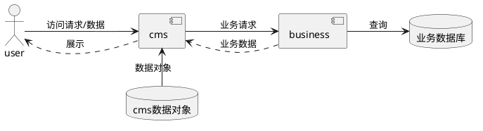
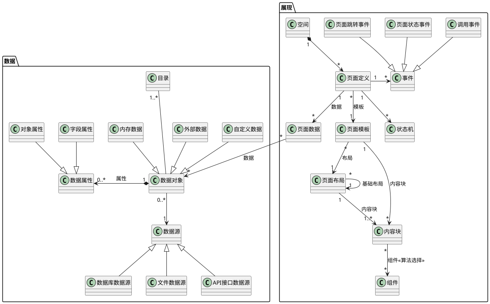

## 前言

CMS已经是一个很老的概念了，但是在手机app、小程序、公众号大行其道的今天，CMS却感觉有些落伍。但是如果从它提供的价值角度看，现在正是应该大行其道的时间。业界开源的重量级CMS系统有很多，例如WordPress、Shopify、Joomla!、Drupal等，这些系统的架构对我影响还是蛮大的，尤其是Joomla，它的模板结构给人感觉很舒服。

我想要的CMS应该是什么样的？首先它需要管理各种类型的数据，并且在各种设备上进行可定制化的展示。比如支持PC网页、移动App、各种小程序等。同时，它也应该有能力接受业务模块的数据，并作为应用的展现前台，帮助业务模块对数据进行展现和收集反馈。

也就是说，我理想中的CMS应该包揽数据的展示和用户输入信息的采集，并为业务模块提供支持。这个流程类似网站的动静分离，只要是内容展现的活儿都留给CMS，开发者专心于业务逻辑的实现，甚至不需要考虑前端终端的种类和型号。

从使用的角度，如果真的有了这种CMS的话，开发工作还可以简化，只需要关注核心对象和逻辑，界面视图的数据组合都不在需要考虑了。

## 概念模型

CMS系统的概念模型主要由两大块构成：数据部分和展现部分。

数据部分主要功能是把经过特征标注的数据提供给页面，以便页面可以把合适的内容呈现在特定的位置；展现部分则是把页面分解为布局、模板、组件，并提供最大限度的灵活性，通过配置组合就可以实现页面展示和交互。

### 数据

数据的抽象概念有两个层次，一个是数据，一个是视图。所谓的数据，其实就是数据实体，也可以理解为数据库或者任意的存储设备和格式的数据；所谓的视图，则是数据的多种组合方式。如果你理解 GraphQL 的话，可以理解得更透彻一些。

例如用户信息，当我们验证登录密码的时候，这个场景下的用户信息视图就只需要有用户名和密码即可；如果我们要显示用户的详细信息，那么视图包含的数据就更贴近用户实体的定义，要用户名、密码、昵称、备注、拥有的权限等；如果从用户特征分析的角度去看用户信息，除了用户名、昵称、备注之外，可能还要计算用户的各种标签。

### 展现概念模型

## 